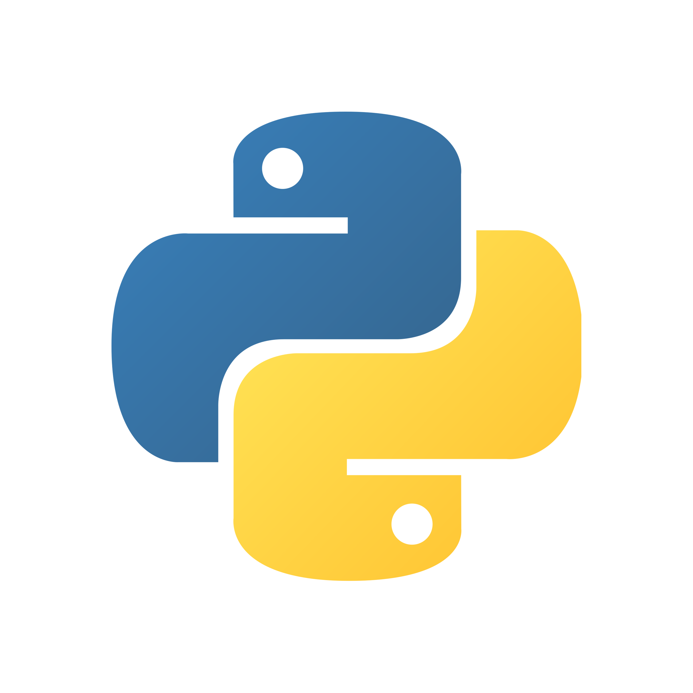

# This repository is for the Creative Coding: Python class
## Spring 2025
## Faculty: Yu Lee

### Directory
1. [Week 2 - Feb 03 2025](#Week-2)
2. [Week 3 - Feb 10 2025](#Week-3)
3. [Resources](#Resources)

# Week 2

## Assignment 2: py5

*Mondrian Artwork*

Randomized color every time sketch is run

Mouse_x and mouse_y interaction, turning the color darker

[Code](https://github.com/carbudar/Creative_Coding_Python/commit/7c8736ea7c2ac99eb5b984ce12ab290f4da1c391)

# Week 3

## Assignment 3: Scroll Art

### Iterations + Process

*Fish In The Sky*

Derived from Skulls and Hearts by 
[Al Sweigart](https://scrollart.org/skulls-and-hearts/)

[Cloud ASCII Art](https://www.asciiart.eu/nature/clouds)

[Fish ASCII Art](https://www.asciiart.eu/animals/fish)

[Code](https://github.com/carbudar/Creative_Coding_Python/commit/e44a440fe3ba2c8e9789e3ec608e19b5186bc8ff)

# Resources
[Python in 10 Minutes](https://www.stavros.io/tutorials/python/)

