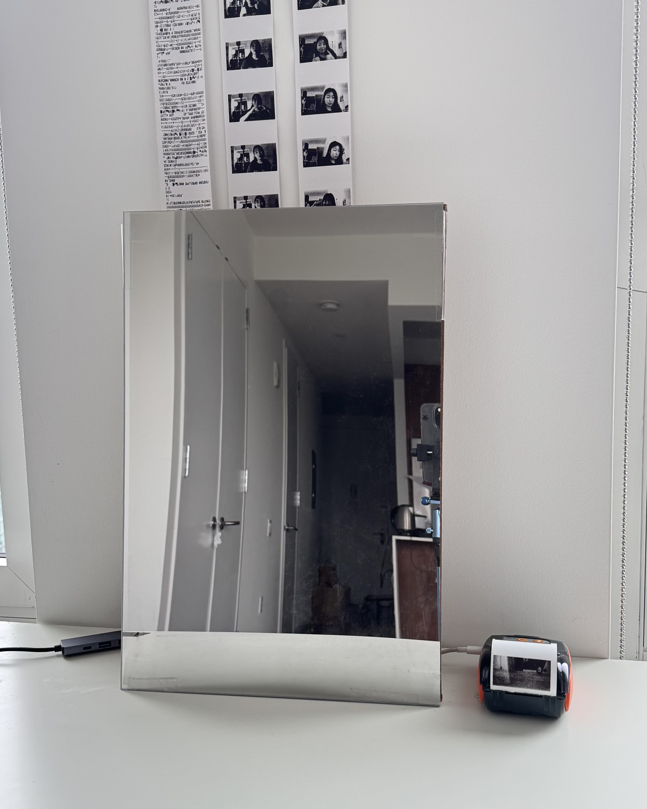

# This repository is for the Creative Coding: Python class
## Spring 2025
## Faculty: Yu Lee

### Directory
1. [Week 2 - Feb 03 2025](#Week-2)
2. [Week 3 - Feb 10 2025](#Week-3)
3. [Week 4 - Feb 17 2025](#Week-4)
4. [Week 5 - Mar 16 2025](#Week-5)
5. [Week 7 - Mar 23 2025](#Week-7)
6. [Week 8](#Week-8)
7. [Week 9](#Week-9)
8. [Final Project Proposal](#proposal)
9. [Week 10](#Week-10)
10. [Final Project](#Finals)
11. [Resources](#Resources)

# Week 2

## Assignment 2: py5

*Mondrian Artwork*

Randomized color every time sketch is run

Mouse_x and mouse_y interaction, turning the color darker

[Code](https://github.com/carbudar/Creative_Coding_Python/commit/7c8736ea7c2ac99eb5b984ce12ab290f4da1c391)

# Week 3

## Assignment 3: Scroll Art

### Iterations + Process

*Fish In The Sky*

Derived from Skulls and Hearts by 
[Al Sweigart](https://scrollart.org/skulls-and-hearts/)

[Cloud ASCII Art](https://www.asciiart.eu/nature/clouds)

[Fish ASCII Art](https://www.asciiart.eu/animals/fish)

[Code](https://github.com/carbudar/Creative_Coding_Python/commit/e44a440fe3ba2c8e9789e3ec608e19b5186bc8ff)

# Week 4

## Assignment 4: Turtle
*Circle Pattern*

Inspiration image

Turtle sketch

# Week 5

## Assignment 5: PyGame
*Modified Spaceship Game*

Game UI

### What I Added:
1. Background image,
2. Points and missed enemy counter,
3. Levels - after 10 points, the game goes faster
4. Color overlays - Red to indicate missed enemy, and green to indicate level up
5. Sound effects - (shooting  bullets, enemy shot, enemy goes out of bound, level up)

[Code and Assets](https://github.com/carbudar/Creative_Coding_Python/tree/main/pygame)

# Week 7

## Assignment 5: DataVis
*NYC Squirrel Sensus Data*
https://data.cityofnewyork.us/Environment/2018-Squirrel-Census-Fur-Color-Map/fak5-wcft

### Showing Color of squirrel on X and Y axis from data

[Code and Data](https://github.com/carbudar/Creative_Coding_Python/tree/main/Squirrel%20Fur%20DataVis)

# Week 8

## Assignment 5: Web Scraping
*https://en.wikipedia.org/wiki/List_of_Adventure_Time_characters*

[Code and Data](https://github.com/carbudar/Creative_Coding_Python/tree/main/WebScraping)

# Week 9

## Assignment 8: LLM

For this project, I tried to make a web app that generates poem based on user input. I used the google/flan-t5-small model and played around with the prompt and temprature. However, regardless of the temprature and prompts, none of the trials I did seem to generate outputs that make sense. I found all of the output to be weird and gibberish. I am not sure how to fix though.

[Code](LLM)

# Proposal

## Final Project Proposal

For the final project, I aim to leverage the techniques that I learnt through this class and combining it with physical computing, briding the connection of digital art and the physical world. I currently have two main ideas that I plan to build on.

Idea 1:
Creating scroll art in Phython and translating it onto an LED board module powered by arduino. This will allow me to display continous digital art, physically.
For this idea, I will need some electronics, like: Arduino board, small LEDs, and wiring.

Idea 2:
Making a tetris game using pygame and creating a physical control module to control the game through tactile input powered by Arduino microcontroller. For this concept, I am going to require  some buttons/ joystick for positional controls, ardunio board, screen, and some electronics for wiring. 

Though I am not sure currently how can I connect my phython script to the arduino computer, I found [this tutorial](https://youtu.be/UeybhVFqoeg?si=gSxDdFVdoNVa0tvt) that shows how I can controll the Arduino controller through a Python program, bypassing ArduinoIDE.

# Week 10

## Bad UI
For this project, I expanded on the Phone Dial UI that was discussed in class and made the UI bad. I randomized each number that are clicked, disabled keyboard input, and added a clear button that only deletes all input.

# Finals

## Final Project: Mirror Selfie

Acrylic, chipboard, electronics
12 x 18 in

In this project, I explored the interaction between people and mirrors. When walking by a mirror, I noticed that a lot of people tend to subconsciously stare at it to check their own appearance or to take mirror pictures. However, after I learnt about spy mirrors or two-way mirrors, I felt more cautious interacting with mirrors due to my paranoia of being spied on.
For this project titled “Mirror Selfie”, I am embodying my fear of being stared back at by the mirror or anything behind the mirror. Using a camera with the OpenCV Python library, I detect faces and print out a frame of the moment when anyone looks into the mirror.

[More Documentation](https://github.com/carbudar/Creative_Coding_Python/blob/main/Device%20Art%20Final%20Documentation.pdf)

# Resources
[Python in 10 Minutes](https://www.stavros.io/tutorials/python/)

